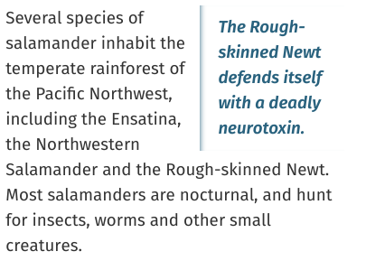

# aside

둘러싼 내용과 관련이 있지만 흐름상으로 이어지지 않는 내용에 대해 지정하는 태그입니다.

해당 문서의 정보를 보강하는 용도로 사용하지만, 없어도 딱히 전체적인 내용을 이해하는데 지장이 없는 내용을 지정할 때 의미론적으로 사용합니다.

## Default CSS

```css
aside { 
  display: block;
}
```

## 광고 영역으로 사용해도 될까?

aside는 의미론적으로 **본문과 연관이 있는** 내용을 포함해야 합니다.

레이아웃 상 사이드바 혹은 광고영역으로 사용할 때 역시 연관 상품 목록, 관련 아티클 목록 등 해당 본문과 연관이 있는 컨텐츠를 표시할 때 사용되어야 합니다.

따라서 막연하게 광고 영역으로 사용하는 부분에 있어서는 신중해야만 합니다.

(Google Ads의 타깃광고가 꼭 게시물의 연관 상품을 보여주진 않습니다)

## 예시 (출처 : MDN)



```html
<p>Salamanders are a group of amphibians with a lizard-like appearance, including short legs and a tail in both larval and adult forms.</p>

<aside>
    <p>The Rough-skinned Newt defends itself with a deadly neurotoxin.</p>
</aside>

<p>Several species of salamander inhabit the temperate rainforest of the Pacific Northwest, including the Ensatina, the Northwestern Salamander and the Rough-skinned Newt. Most salamanders are nocturnal, and hunt for insects, worms and other small creatures.</p>
```

인용문을 삽입할 때 대표적으로 사용될 수 있는데, CSS를 사용하여 aside로 삽입된 인용문을 컨텐츠 영역의 사이드에 배치하기도 합니다.
