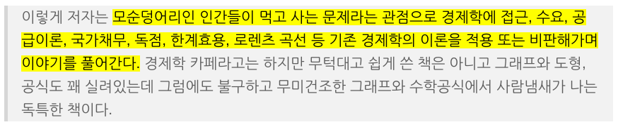

# Text Style Tags

각종 문구 태그(phrase-tags)들에 대해 알아본다.

CSS에서 text-decoration 속성을 이용해 동일한 시각적 효과를 낼 수 있으므로, 오로지 의미론적 구분을 위한 용도로만 사용되어야 한다.

## b & strong

### b

특별한 의미 없이 문구를 bold 처리하여 시각적인 강조를 위해 사용한다.

*b 태그는 해당 구문을 위한 더 적합한 의미론적 태그를 찾지 못 했을 때 사용한다.*

### strong

문장 속 중요한 문구를 정의할 때 사용한다.

#### 예시

```html
<p>이 스위치를 누르면 전원이 꺼집니다. <strong>종료 전 중요한 내용을 저장해주세요.</strong></p>
```

## i & em

### em - Emphasized Text

em 태그는 특정 텍스트를 강조할 때 사용한다.

특정 문구에 강조를 주어 문장의 의미를 분명히 한다.

일반적으로 이탤릭체로 표현이 된다.

#### 예시

```html
<p>당신은 정말 <em>아름다운</em> 사람이군요.</p>
<p>여기서 나가세요 <em>당장</em>!</p>
```

### i

과거 이탤릭체를 나타내기 위한 태그로 사용되었으나, HTML5 부터 의미가 변화하였다.

i 태그는 기술 용어나 외국어 문구, 배 이름과 같이 문장내 구분지어야 될 내용이 있을 때 구분하는 용도로써 사용한다.

*i 태그는 해당 구문을 위한 더 적합한 의미론적 태그를 찾지 못 했을 때 사용한다.*

#### 예시

```html
<p><i>DDH-976 문무대왕함</i>은 스텔스 기능을 갖춘 대한민국 충무공이순신급 구축함의 2번함이다.</p>
```

## mark

문장 내 특정 문구를 하이라이트 처리 한다.

형광펜으로 마킹하는 것과 비슷한 의미로 생각하면 된다.

### 예시

```html
<blockquote>이렇게 저자는 <mark>모순덩어리인 인간들이 먹고 사는 문제라는 관점으로 경제학에 접근, 수요, 공급이론, 국가채무, 독점, 한계효용, 로렌츠 곡선 등 기존 경제학의 이론을 적용 또는 비판해가며 이야기를 풀어간다.</mark> 경제학 카페라고는 하지만 무턱대고 쉽게 쓴 책은 아니고 그래프와 도형, 공식도 꽤 실려있는데 그럼에도 불구하고 무미건조한 그래프와 수학공식에서 사람냄새가 나는 독특한 책이다.</blockquote>
```



## dfn

문서내에서 어떤 **용어의 정의**가 *처음으로* 등장했을 때, dfn 태그를 사용하여 의미를 부여합니다.

### 예시

```html
<p><dfn><abbr title="Hypertext Markup Language">HTML</abbr></dfn>은 웹문서의 각 내용과 속성에 대한 부분을 구조적으로 구분하여 기록하기 위해 사용하는 언어입니다.</p>
<p>HTML은 프로그래밍 언어가 아닙니다.</p>
```

## ruby rt rp

루비 주석을 표현할 때 사용한다.

일본어에서 한자의 읽는 방법을 표기할 때 주로 사용한다.

rt 태그 안에 루비 주석을 명기하고, ruby 태그를 지원하지 않는 브라우저를 위해 rp 태그를 덧붙인다.

루비 태그를 지원하는 브라우저는 rp 태그 속 텍스트를 표시하지 않지만,

루비 태그를 지원하지 않는 브라우저는 해당 텍스트를 표기한다.

```html
<ruby>韓國<rp>(</rp><rt>kankoku</rt><rp>)</rp></ruby>
```

> <ruby>韓國<rp>(</rp><rt>kankoku</rt><rp>)</rp></ruby>

## s 와 del

s와 del 태그 모두 텍스트에 취소선을 긋는다.

더이상 유효하지 않아 삭제된 정보를 의미론적으로 표현하고자 한다면 del 태그를 사용해야한다.

**del 태그는 cite 속성으로 해당 내용이 삭제된 이유를 url로 링크할 수 있다.**

**또한, datetime 속성으로 해당 내용이 언제 삭제가 되었는지 지정할 수 있다.**

```html
<p><s>34000원</s> 32000원</p>
<p><del>34000원</del> 32000원</p>

<p><del cite="http://world.info/유가-하락" datetime="2019-06-23">34000원</del> 32000원</p>
```

><p><s>34000원</s> 32000원</p>
><p><del>34000원</del> 32000원</p>

## sub sup small

### sub 과 sup

아래첨자 윗첨자를 표기할 때 사용한다.

```html
x<sub>n</sub> 와 x<sup>2</sup>
```

> x<sub>n</sub> 와 x<sup>2</sup>

### small

작은 크기의 문장을 표현할 때 사용한다.

```html
<small>보조 코멘트 등을 표기할 때 사용한다.</small>
```

## q

인라인 인용문을 나타낼때 사용합니다.

cite 속성으로 출처 url을 지정할 수 있다.

### 예시 

```html
<p>According to Mozilla's website,
  <q
  cite="https://www.mozilla.org/en-US/about/history/details/">Firefox 1.0
  was released in 2004 and became a big success.</q></p>
```

## cite

어떤 작품의 이름을 의미론적으로 구분할 때 사용한다.

영화 제목, 방송 제목, 노래 제목, 책 이름 등을 나타낸다.

일반적으로 이탤릭체로 표현된다.

```html
<p><cite>The Scream</cite> by Edward Munch. Painted in 1893.</p>
```

## code & samp & kbd

### code

프로그램 코드를 의미합니다.

고정폭 글꼴로 표현됩니다.

### samp

어떤 프로그램 코드의 출력 샘플을 의미합니다.

### kbd

키보드 인풋을 의미합니다.

### 예시

```html
<code>
function Test(a, b) {
    console.log(`>>> result ${a + b}`);
}

Test(12, 13);
</code>

<p><var>a</var>는 12를 할당 받고, <var>b</var>은 13을 할당받습니다.</p>

<p><samp>
>>> result 25
</samp></p>

<p><kbd>Alt + F4</kbd>를 입력하면 화면을 종료합니다.</p>
```
